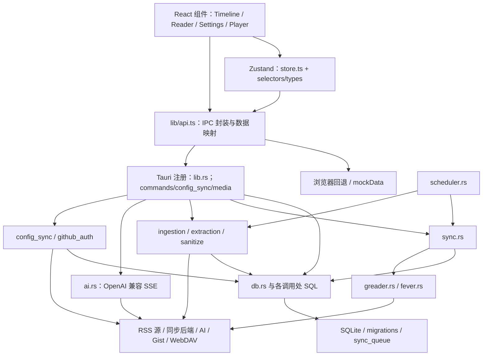

# 当前架构

性质：现状静态图。对应源码 6550a223d3e5fb4cae66b07af31fc35c5f1fd6a9。运行行为未验证；目标架构尚未决定。

## 模块与调用关系

这张图不声明层间隔离已经被强制执行。部分组件直接调用 API；commands.rs 和 sync.rs 也直接执行 SQL，不能沿用“所有 SQL 只在 db.rs”的旧注释作为架构事实。

## 前端

- src/types.ts：实体与五种布局类型；画廊内部值是 image。
- src/store.ts：导航、筛选、文章水合、阅读状态、AI 流、播放器与设置等状态和流程。
- src/store/selectors.ts：派生视图、可见条目和计数等。
- src/lib/api.ts：Tauri invoke 封装、Rust/前端数据映射、浏览器回退。浏览器能够显示页面不证明真实 IPC 可用。
- components/：主要交互和渲染；SettingsModal、Overlays、PlayerBar 等直接使用 API。
- styles/：样式和主题；本阶段未进行视觉核验。

## 后端与运行时

src-tauri/src/lib.rs 注册 Tauri 插件、命令和窗口事件，在应用数据目录打开 SQLite，构建 AppState，启动刷新与封面回填。

AppState 的实际定义是 Arc<tokio::sync::Mutex<rusqlite::Connection>>、共享 reqwest Client、媒体句柄和 GitHub 授权临时状态。当前不是 README 旧描述中的 std::sync::Mutex。

- commands.rs：IPC 入口与部分业务编排、直接 SQL、AI 流式 Channel。
- sync.rs：队列推送、订阅拉取、条目与状态处理；Backend 枚举分派 Google Reader/Fever，且使用 greader 类型作为部分共享数据结构。
- scheduler.rs：后台刷新和同步调度。
- ingestion.rs / extraction.rs / sanitize.rs：抓取、全文提取、HTML 清洗等。
- db.rs：迁移、主要数据访问、去重与队列；SQL 尚未全部集中于此。
- config_sync.rs / github_auth.rs：配置同步与 GitHub 设备授权。
- credentials.rs / media.rs：Windows 凭据保护与系统媒体控制等平台能力。

源码注释提出“锁内读写、锁外 HTTP”的约束；未逐条验证所有 await 与数据库锁路径，不宣称已证明不存在阻塞或竞态。

## 持久化与边界

SQLite 迁移共 13 步，主要实体见 DATA-MODEL。协议选择和连接参数存于 settings；文章、订阅等具有 remote_id 映射。

AI 事件通过 Tauri Channel 返回前端，结果有本地缓存路径。正文与译文的清洗和渲染需要跨 Rust / IPC / store / React 验证，单层测试不能证明整条链路安全正确。

## 后续设计输入

产品保留范围已按 DEC-008 / DEC-009 更新：核心及 FEATURES 中全部 OPT 项必须保留，OPT-004 收敛为仅同步订阅源与客户端设置，包含非敏感地址/模型配置并排除 API Key/密码等凭据。现状图继续展示当前实现；后续需评估配置 payload 与目标字段清单的差异，不能将文档范围调整描述为已经完成的代码修改。

候选审查区域包括：store.ts 的职责、commands.rs 与 db.rs 的 SQL 边界、同步领域与协议类型耦合、测试对 Tauri/全局状态的依赖。它们是调查方向，不是已批准的拆分方案。

先取得测试基线和产品范围，再在独立的目标架构文档与 ADR 中提出边界调整；不预先决定整体重写或更换技术栈。
